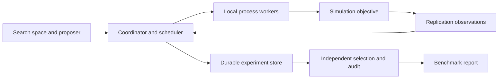

# Aster: Parallel Hyperparameter Optimization for Noisy Simulations

Status: target architecture and research plan. A v0.1 prototype now implements a subset;
see [README.md](README.md) for current behavior and [ROADMAP.md](ROADMAP.md) for remaining
work. No comparative benchmark results are established yet. API sketches below describe
the intended system and are not the current runnable API.

## Project thesis

Build a Python library that reduces the wall-clock time and total computation required to find high-quality hyperparameters for expensive, stochastic simulation workloads. Its distinctive feature is an asynchronous scheduler that allocates repeated evaluations according to uncertainty, rather than eliminating configurations using only their observed average performance.

Research question: **At a fixed worker count, can uncertainty-aware allocation of simulation replications reach a predefined quality target faster than full-budget search and standard asynchronous successive halving?**

Assume one developer, 10–12 weeks, and a workstation with 8 available CPU cores. A useful release must work on a laptop. Cluster execution is an extension.

The library accelerates the optimization campaign by running evaluations concurrently and avoiding unnecessary evaluations. It does not inherently make an individual simulation kernel faster. Keeping this distinction explicit makes the performance claim defensible.

## Why this is a credible contribution

Parallel optimization already exists in [Optuna](https://optuna.readthedocs.io/en/stable/tutorial/10_key_features/004_distributed.html), and [Ray Tune](https://docs.ray.io/en/latest/tune/key-concepts.html) separates configuration search from resource scheduling. Consequently, parallel execution alone is insufficient differentiation.

Aster's proposed contribution is a focused combination of simulation replication, paired scenario comparisons, asynchronous execution, and independently measured quality preservation. This is a research hypothesis and engineering contribution, not a claim to have invented these techniques. [Common random numbers already have a substantial optimization literature](https://arxiv.org/abs/1910.09259).

| Audience | Evidence the project should provide |
| --- | --- |
| Quantitative researchers | Clear objective, uncertainty treatment, independent evaluation, sensitivity to market assumptions |
| Research engineers | Modular Python API, reliable parallel execution, profiling, reproducible experiments |
| Recruiters | A concise problem statement, an understandable financial application, and measured time and compute savings |

## Flagship application: simulation-trained derivative hedging

Train a small neural hedging policy on simulated price paths with proportional transaction costs. Tune its learning rate, hidden width, batch size, and regularization. The network weights are learned within each trial; its training hyperparameters are chosen by the library. This makes the example genuine HPO.

Use a deliberately small problem: one underlying, one European call, a fixed trading grid, bounded hedge positions, and a two-layer network. Begin with geometric Brownian motion. Add stochastic volatility only after the complete benchmark works. Neural hedging under transaction costs has an established research foundation in [Deep Hedging](https://arxiv.org/abs/1802.03042); implementing a new hedging method is outside this project's core contribution.

For a hyperparameter configuration x, let Y(x, s) be the mean squared terminal hedging error from one complete train-and-evaluate replication under seed bundle s. Terminal portfolio wealth includes transaction costs and uses a fixed initial endowment across configurations. Evaluate training outcomes on fresh paths within every replication.

The objective is J(x) = E_s[Y(x, s)]. Fix the loss definition, financial parameters, training path budget, horizon, numerical resolution, and evaluation path count before the comparison. A configuration must not improve its score by changing the financial problem or receiving a cheaper simulation model.

Report hedging-error quantiles, turnover, transaction costs, and training instability alongside the scalar objective. These diagnostics do not automatically become additional optimization objectives. Compare the policy against a simple delta hedge as a simulator sanity check, not as a baseline HPO algorithm. Synthetic-market performance is evidence about the modeled task, not live trading profitability.

One replication includes independently training a model and evaluating it. Evaluation paths sharing the same trained model are not independent training replications. A checkpoint can extend an interrupted replication; a new replication must start a new training run.

## Resource allocation and quality

Use replication count as the initial resource axis, with illustrative checkpoints at 3, 9, and 27 replications per configuration. These counts are pilot settings, not statistically sufficient defaults. Each replication retains the same simulation and training specification. Increasing the count improves estimation precision without deliberately coarsening the simulation.

This is adaptive replication allocation. Reserve the broader term multi-fidelity for an extension that changes training budgets, path counts, or numerical resolution. Such changes can alter configuration rankings and require separate validation.

Maintain separate random-number namespaces for configuration generation, training data, model initialization, optimization evaluation, finalist selection, and final audit. Where applicable, compare configurations using the same exogenous market scenarios. Align randomness by scenario and time index rather than assuming that the same integer seed aligns different programs. Shared randomness can reduce variance when it induces favorable covariance; measure that effect and retain an independent-scenario ablation.

Define quality preservation relative to a reference method:

    Delta = J(selected_by_Aster) - J(selected_by_reference)

Lower loss is better. Before the final benchmark, choose an absolute non-inferiority margin epsilon in the loss's units, informed by a disjoint pilot. For example, epsilon could be 1% of a frozen pilot reference loss. The result supports quality preservation only if a predeclared one-sided 95% upper confidence bound for Delta is below epsilon. An inconclusive interval is not evidence of equivalence.

After search, select finalists using a reserved selection budget, then evaluate the locked winner using independent training replications and market paths. The audit must not feed back into optimization or winner selection. Include selection compute in reported optimization cost; report audit compute separately and also provide total experiment cost.

Across repeated optimizer runs, use a paired experiment design and quantify uncertainty at the run level, accounting for any nested replications. A fixed-sample bootstrap or t-based analysis is empirical and assumption-dependent, especially for heavy-tailed losses. Choose replication counts using pilot variability and available compute before inspecting final results.

## Scheduler design

Implement three interchangeable schedulers: full-budget FIFO, standard ASHA, and an experimental uncertainty-aware replication scheduler. [ASHA](https://arxiv.org/abs/1810.05934) is established prior work and an essential comparator.

Start with a frozen pool of randomly sampled configurations. This separates configuration selection from allocation and avoids an adaptive searcher exploiting repeatedly reused scenario seeds. Add an Optuna sampler adapter after the scheduler experiment works, documenting how fresh comparison scenarios are assigned to newly proposed configurations.

At each worker completion:

1. Persist the observation using its unique configuration and replication identity.
2. Update means, variances, and paired differences on overlapping scenario identities.
3. At a replication checkpoint, compare the candidate with an eligible incumbent using matched observations.
4. Stop candidates whose estimated disadvantage exceeds a chosen tolerance with sufficient evidence; allocate additional replications to ambiguous candidates.
5. Dispatch available work immediately, reserving a fixed share of slots for configurations that have not reached their minimum replication count.

The initial practical decision rule may use paired standard errors, but must be labeled a heuristic. Repeatedly inspected ordinary confidence intervals do not establish an overall 95% selection guarantee. If intervals are too wide, continue evaluation up to the cap; do not force a statistically justified elimination claim when none exists.

An optional research extension can use [confidence sequences](https://arxiv.org/abs/1810.08240) with stated distributional assumptions, fresh comparison data, and multiplicity control across configurations and comparisons. Confidence sequences alone do not resolve adaptive candidate selection or guarantee a global optimum. Do not apply bounded-loss guarantees to unbounded squared financial losses without a justified change of assumptions or objective.

Require comparable replication counts for ranking at checkpoints. Record every elimination, its supporting observations, and the incumbent used. Model size and runtime may correlate with quality; minimum evaluation budgets and exploration slots reduce premature preference for configurations that finish quickly. Test this explicitly.

## Library architecture



| Component | Responsibility |
| --- | --- |
| Search space / proposer | Typed continuous, integer, and categorical parameters; random search first |
| Objective protocol | Evaluate one configuration and replication; return scalar loss, metrics, timing, and artifact references |
| Scheduler | Choose new work, extend candidates, stop candidates, enforce budgets |
| Executor | Spawn local worker processes, manage deadlines and failures |
| Seed manager | Stable seed bundles and scenario identities independent of worker assignment |
| Store | Trial state, observations, decisions, manifests, checkpoint references |
| Reporter | Quality-versus-time curves, CPU-hours, scaling, failures, and audit results |

Use Python, NumPy, a process pool, and a coordinator-owned SQLite store for the initial runtime. Use PyTorch only in the hedging example. Keep Optuna and Ray in optional adapters and benchmark dependencies. Write the scheduler and experiment lifecycle yourself; use established numerical and modeling libraries.

Workers return observations to one coordinator rather than writing concurrently to SQLite. Deduplicate completed work by experiment, configuration, and replication ID. Use attempt IDs to reject stale results after a retry. Account for wasted attempts in compute totals. Retry infrastructure failures with the same seed; record numerical divergence as a distinct outcome using a predefined penalty/failure policy instead of hiding it through retries.

Persist state transitions and checkpoint references transactionally. Resume unfinished work after a coordinator restart and cap retries. Limit numerical-library threads per worker to avoid nested CPU oversubscription. Choose chunk sizes by profiling actual overhead rather than inserting artificial sleep into simulation benchmarks.

Exact repeated asynchronous search trajectories are not guaranteed because completion order changes. Provide deterministic objective evaluations, event-log replay for scheduler decisions, and a synchronous debug mode. Record code revision, dependency versions, machine details, thread settings, seeds, and simulator configuration.

Proposed API, not currently implemented:

```python
def objective(config, replication):
    model = train_hedger(config, seeds=replication.training_seeds)
    return evaluate_hedger(model, scenarios=replication.evaluation_scenarios)


study = Study(
    space=hedging_space,
    proposer=RandomProposer(seed=17),
    scheduler=ReplicationRace(checkpoints=[3, 9, 27]),
    executor=LocalProcesses(workers=8, threads_per_worker=1),
    storage="experiments/hedging.sqlite",
)
result = study.optimize(objective, wall_time_seconds=3600)
# Independent selection and audit are separate, explicitly budgeted stages.
```

## Benchmark protocol

Run two required workloads: cheap synthetic objectives with known optima and controllable noise, and the simulation-trained hedging example. Synthetic tests cover unequal variances, near ties, heavy tails, and runtime correlated with objective quality. Artificial runtime variation belongs only in clearly labeled scheduler stress tests.

Use these comparisons:

| Comparison | What it isolates |
| --- | --- |
| Serial random search, full replication budget | End-to-end reference |
| Parallel random search, full replication budget | Benefit from concurrency |
| Parallel random search + ASHA on replication count | Benefit of ordinary pruning |
| Parallel random search + proposed scheduler | Benefit of uncertainty-aware allocation |
| Optuna TPE with full evaluations | Established adaptive configuration search |
| Ray Tune random search + ASHA | Established runtime and scheduler comparison |

Use the same candidate pool for allocation-only comparisons. Let TPE generate its own candidates and label this as a whole-method comparison. Match worker count, thread limits, search space, simulator settings, resource caps, seed protocol, and selection budgets. Pin baseline versions and explain any unsupported features.

Measure separately:

- Wall time to reach a quality threshold frozen from pilot work; use a fixed reporting grid and separate monitoring evaluation. Include monitoring overhead and audit the final result independently.
- Final audited quality under equal wall-time budgets and, separately, equal CPU-hour budgets.
- Total CPU-hours, executed replications, scheduler overhead, utilization, failure and retry cost.
- Scaling at 1, 2, 4, and 8 workers on hardware that supports those allocations.
- Optimization stability across independent runs; aim for 20 runs on the small benchmark, choosing expensive-run counts before testing based on pilot precision and compute.

Report failures to reach the target as censored runs or attainment rates, not as omitted observations. Distinguish speedup from extra hardware, speedup from fewer evaluations, and fixed-workload parallel efficiency. Use confidence intervals rather than a single best seed. Publish all primary benchmark outcomes, including cases where the proposed scheduler loses.

Required ablations: disable uncertainty-aware elimination, disable shared scenarios, and replace asynchronous dispatch with synchronous rounds. Keep all other settings fixed for each comparison. Measure scheduler overhead as the synthetic objective becomes cheap.

An aspirational result is at least 2x lower median time to target than parallel full-budget random search at the same worker count, with audited non-inferiority and lower CPU-hours. This is a target, not an expected or achieved result. Beating ASHA is the harder research question; a measured explanation of when it wins or loses is valuable even without universal improvement.

## Delivery plan

| Weeks | Deliverable and exit condition |
| --- | --- |
| 1–2 | Objective protocol, seed handling, serial reference, synthetic cases, minimal hedging simulator; establish repeatability and pilot costs |
| 3–4 | Local parallel executor, durable store, resume, retries; demonstrate concurrency and injected-failure recovery |
| 5–6 | ASHA comparator and uncertainty-aware scheduler; log and inspect elimination decisions on synthetic cases |
| 7–8 | Complete hedging HPO workflow, shared-scenario comparisons, finalist selection and independent audit |
| 9–10 | Freeze protocol; execute baselines, ablations, profiling, and scaling experiments |
| 11–12 | Package, documentation, research report, reproducibility command, and short demo |

If the hedging benchmark exceeds the compute budget, reduce the network, path count, and candidate pool consistently during the pilot, then freeze them. Preserve the baselines and independent audit. Drop cluster support and additional financial models first.

Meaningful tests cover deterministic seed assignment, pairing integrity, duplicate result handling, stale retry rejection, interrupted-run recovery, budget enforcement, search/audit isolation, and objective sanity checks. Statistical coverage tests apply only to an explicitly implemented guarantee with matching assumptions.

Stretch goals: Ray executor, TPE proposer integration with adaptive allocation, stochastic-volatility benchmark, cost-aware scheduling, and a formal bounded-objective selection procedure. Avoid making a dashboard, cloud infrastructure, GPU support, or a custom Bayesian optimizer prerequisites for the first release.

## Portfolio presentation

Deliver an installable package, a 5–8 page technical report, machine-readable experiment results, and a reproducible benchmark command. Include three main figures: audited quality versus wall time, CPU-hours versus quality, and speedup versus workers. A worker timeline explains asynchronous behavior; a paired-difference plot explains the statistical decision.

The five-minute demo should show a normal run, an explained pruning decision, recovery from a worker failure, and the resulting independent quality comparison. Label development measurements and final benchmark results distinctly.

Resume template, to fill only after measurement:

> Built a parallel hyperparameter optimization library for stochastic financial simulations; reduced time to a predefined hedging-quality target by [X] and CPU-hours by [Y] versus [baseline] on [hardware], with independently evaluated loss degradation below [margin] under [stated analysis].

The interview discussion should explain why ordinary early stopping can discard noisy winners, how replication allocation differs from numerical fidelity, how shared scenarios affect comparisons, where parallel overhead dominates, and what the experiments do and do not establish.
