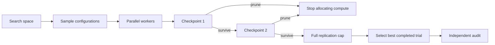

# Aster

**Parallel hyperparameter optimization for stochastic simulations with adaptive replication allocation.**

[](https://github.com/kenchengkc/aster-hpo/actions/workflows/ci.yml)
[](LICENSE)

Aster is a research prototype for tuning models whose evaluation is noisy and expensive. Rather than spending the same number of replications on every configuration, it can evaluate candidates in parallel and stop configurations whose matched outcomes look clearly worse than their peers.

The core question is simple: **can we spend fewer simulation runs while preserving the quality of the selected configuration?**

## What is implemented

- Local multi-process parallel evaluation
- Random configuration sampling over typed search spaces
- Fixed-budget search for a clean baseline
- Adaptive replication racing at configurable checkpoints
- Shared-scenario seeds for paired comparisons across configurations
- Independent post-search audit runs with a disjoint seed namespace
- Deterministic result export including observations, seeds, pruning decisions, timing, and failures
- CI across Linux/macOS and Python 3.11–3.13
- Zero runtime dependencies

## Why noisy HPO is different

For deterministic workloads, evaluating a configuration once may be enough. In simulation-heavy problems, one run can be misleading: random market paths, environment trajectories, initialization, or training noise can make a weak configuration look strong.

The brute-force solution is to replicate every candidate many times. Aster instead explores **sequential replication allocation**—spend a small budget broadly, then continue allocating compute only where the ranking remains uncertain.

The planned flagship workload is neural hedging under transaction costs. The current repository uses a synthetic noisy objective so the scheduler can be tested without market data or GPUs.

## Scheduler design

`FullBudget` evaluates every configuration to the same replication cap.

`ReplicationRace` evaluates candidates at checkpoints such as `(3, 9, 27)`. At each checkpoint, candidates are compared using matched replication indices. A configuration can be pruned when its estimated mean disadvantage, adjusted by a standard-error margin, is sufficiently worse than its peers.



This is intentionally a small research runtime rather than a distributed orchestration system. The project focuses on the replication-allocation problem itself.

## Statistical boundaries

The current pruning rule is **heuristic**, not a formal repeated-testing guarantee. Repeated inspection, adaptive peer selection, and heavy-tailed losses complicate ordinary confidence-interval interpretations.

Aster therefore keeps a strict conceptual separation between:

- **search**, where adaptive pruning is allowed; and
- **audit**, where a locked configuration is evaluated with a separate seed namespace.

The audit reports descriptive mean and standard error. It is not currently a formal non-inferiority test.

## Example

Requires Python 3.11+.

```bash
git clone https://github.com/kenchengkc/aster-hpo.git
cd aster-hpo
python -m venv .venv
source .venv/bin/activate
python -m pip install -e '.[dev]'
python examples/noisy_quadratic.py --workers 2
```

The example compares fixed-budget search with adaptive pruning on the same configuration pool. It writes raw observations, random seeds, pruning decisions, audit observations, and a summary under `results/smoke/`.

Because the toy objective is extremely cheap, process startup dominates timing. The example demonstrates functionality; it is not evidence of real-world speedup.

## Library usage

```python
import random

from aster_hpo import Float, ReplicationRace, Study, audit, sample_configs


def objective(config, replication):
    shock = random.Random(replication.scenario_seed).gauss(0, 0.1)
    return (config["x"] - 0.25) ** 2 + shock


if __name__ == "__main__":
    configs = sample_configs({"x": Float(-2, 2)}, count=16, seed=17)

    result = Study(
        configs,
        scheduler=ReplicationRace(checkpoints=(3, 9, 27)),
        workers=4,
        seed=17,
    ).optimize(objective)

    if result.best_trial is not None:
        check = audit(
            objective,
            result.best_trial.config,
            replications=100,
            seed=17,
        )
        print(result.best_trial.config, check.mean, check.standard_error)
```

Objectives return one finite scalar loss per replication; lower is better. `replication.training_seed` supports configuration-specific randomness, while `replication.scenario_seed` can align exogenous scenarios across configurations for paired comparison.

## Current limitations

- No distributed executor
- No resumable checkpoints
- No automatic retries/deadlines
- No automatic control of numerical-library thread counts
- No formal confidence-sequence pruning guarantee yet
- No completed financial benchmark or comparative speedup study yet

Failures are explicit: exceptions and non-finite losses fail the affected trial, and broken worker pools abort the run rather than silently dropping work.

## Research roadmap

The next meaningful milestone is a controlled benchmark against full-budget search and established asynchronous HPO baselines on an expensive stochastic workload. The evaluation should measure compute saved, wall-clock time, winner regret, and robustness across noise levels—not just raw speed.

See [DESIGN.md](DESIGN.md), [ROADMAP.md](ROADMAP.md), and [docs/BENCHMARKING.md](docs/BENCHMARKING.md) for the detailed protocol.

## Development

```bash
pytest
ruff check .
ruff format --check .
python -m build
```

Maintained by Ken Cheng. Licensed under the [MIT License](LICENSE).

## Research foundations

- [A System for Massively Parallel Hyperparameter Tuning](https://arxiv.org/abs/1810.05934) — ASHA, a planned baseline
- [Bayesian Optimization Allowing for Common Random Numbers](https://arxiv.org/abs/1910.09259) — correlated comparisons and scenario reuse
- [Time-uniform, nonparametric, nonasymptotic confidence sequences](https://arxiv.org/abs/1810.08240) — possible future sequential-inference extension
- [Deep Hedging](https://arxiv.org/abs/1802.03042) — motivation for the planned financial workload

These references motivate the project; their algorithms or results are not claimed as original work in this repository.
